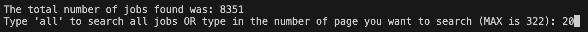
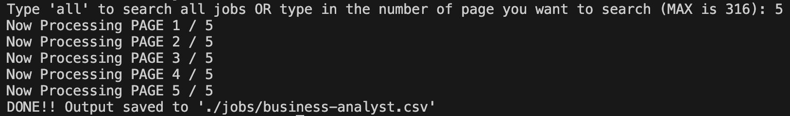

# Job Insights

This is a customizable web scraper for full-time jobs on JobsDB.com HK with in-depth analysis and visualization on current market data to uncover insights that can help job seekers and employers better understand employment trends.

# How to Use

1.  Run the program by running `python job-scraper.py` in the terminal
2.  Enter the keyword that you would like to search for (e.g., business analyst)

    

3.  Enter the number of pages that you would like to search for
    (you can either type in a number for searching a set number of pages OR type in 'all' for searching all pages)

    

4.  Now we wait!

    _(This step could take quite a while depending on a number of factors such as the number of job postings you are scraping, your internet speed, the specification of your machine, etc.)_

5.  Once all the pages have finished processing, all the data will be saved in _\[the keyword you have inputted in step 2\].csv_ under the `/jobs/` directory

    

# Libraries/Frameworks Used

Scraper: Python, Beautiful Soup, Selenium, Pandas

Data Analysis: Python, Jupyter Notebook, Pandas, Numpy, Matplotlib, Seaborn

# Credits

This project and its data are intended for educational purposes only. All data come from JobsDB.com HK. All rights reserved to JobsDB.com HK.
